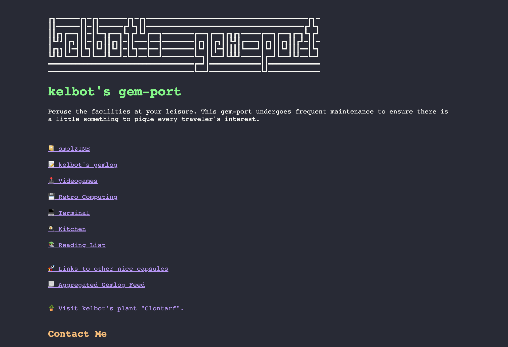

# Gemini proxy

## What?

This repo allows to read gemini websites via http proxy?

## Why?

Just to allow to browse gemini via modern web browser like Firefox

## What works and what does not work

* Downloading gemini pages
* Links are kind of working but are WIP
* Images do not work

## Dependencies

* Node
* [gemget](https://github.com/makeworld-the-better-one/gemget)

## Installation
```
npm install
npm run start
```

This will start http server at port 2456

## Screenshots

